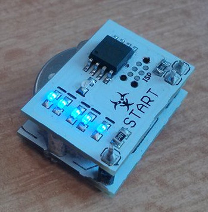
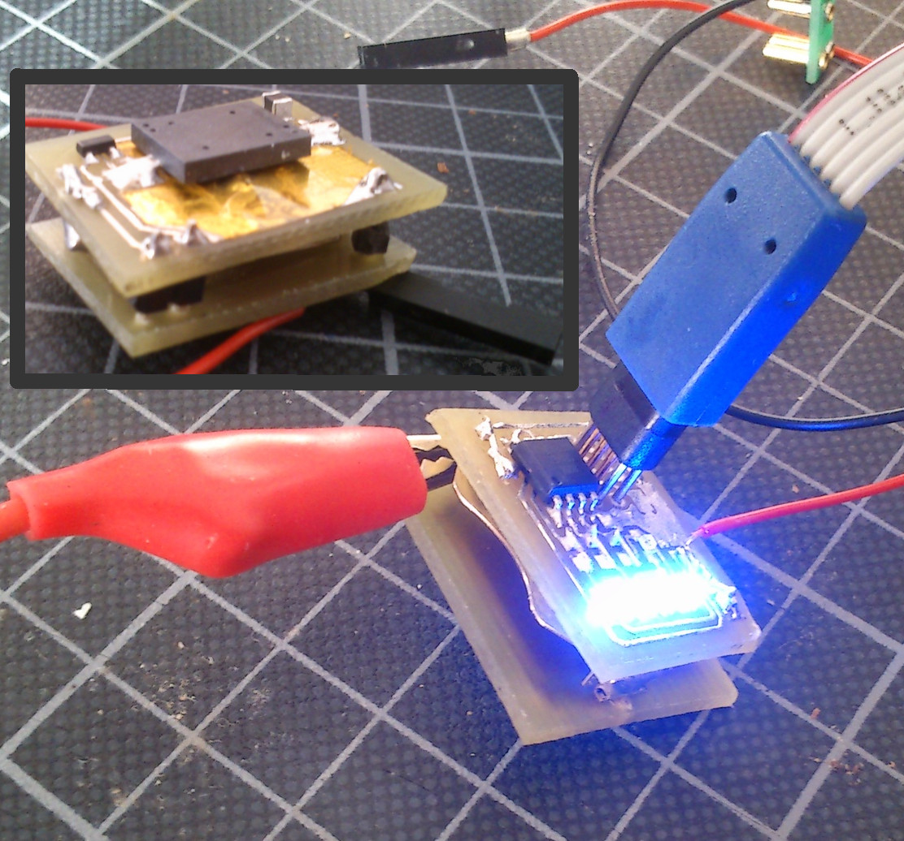
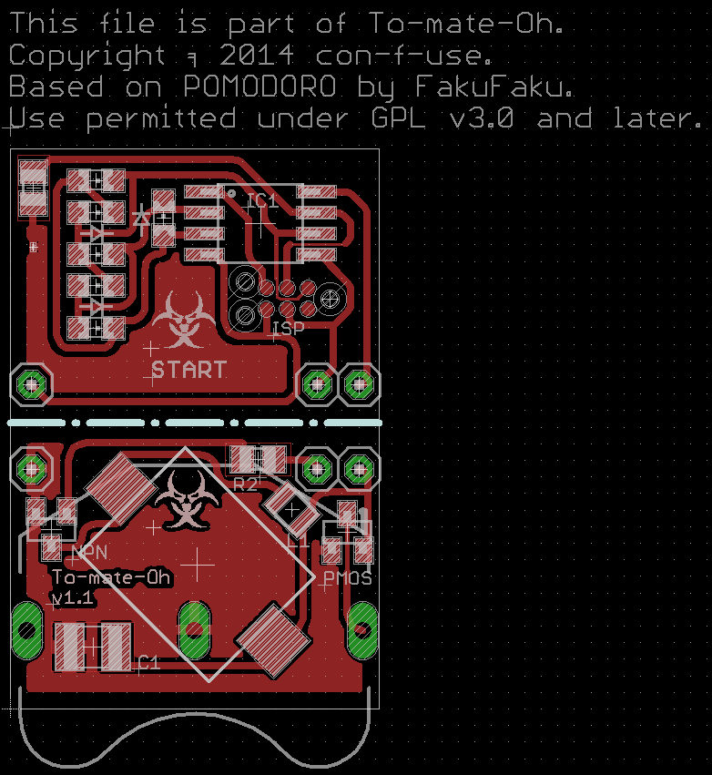

To-mate-Oh
==========

A [pomodoro](http://pomodorotechnique.com/) timer featuring a <a href="https://en.wikipedia.org/wiki/Capacitive_sensing">capacitve touch button</a>, <a href="https://en.wikipedia.org/wiki/Pulse-width_modulation">PWM</a>-driven LEDs and a <a href="https://en.wikipedia.org/wiki/Piezoelectricity#Actuators">piezo buzzer</a>. Based on the <a href="https://github.com/fakufaku/Pomodoro">Pomodoro project</a> by <a href="http://robinscheibler.org">Robin Scheibler</a> (github: <a href="https://github.com/fakufaku">FakuFaku</a>).



*Note: This readme might not always be up to date. Plese consult ./firmware/To-mate-Oh.h and the files in ./docu for more recent information.*

Introduction
------------

I saw the <a href="https://github.com/fakufaku/Pomodoro">POMODORO project</a> by <a href="http://robinscheibler.org">Robin Schreibler</a> and decided to build it. Some may know Robin by the name FakuFaku or from <a href="http://hackaday.com/2014/02/09/hack-all-the-things-in-the-time-you-save-with-this-led-pomodoro-timer/">Hackaday</a>. His' is a very nice layout with beautifully clean code.

__"That can't stand!"__, I thought, so first thing I did was soil the code and complicate the layout. And here is why: I was measuring the power consumption of the original Pomodoro. With a fresh coin cell at 3.3 V, the Pomodoro drained 1.6mA, even when in power down. Your average coin cell has about 200 mAh to give, ignoring the voltage decay. That means after 5 days at most, the battery is gone. This project has since then triggered Robin to fix this bug.


I thought I can do better, and that kind of exploded in my face. Now the board is a quarter of Robin's footprint, has proper reverse polarity protection, drains only about 6 uA (when inactive) and uses less components. Most notably I could do away with four resistors and the switch. The design uses capacitive sensing now and drives the LEDs directly with PWM. The PWM has the added benefit of dimming the LEDs to indicate passed time. You can tweak the duty cycle in code to work with the old hardware (or bridge the unnecessary resistors). On the down side, the code is much, much uglier (but uses only a third of the space on the micro controller). I think it's an improvement, but judge for yourself.

Anyways, many thanks to Robin for making his project open source and being awesome!

Using the Board
---------------

From Robins original documentation (with additions of my own):

1. One click starts a 25 minutes _work_ counter. Five LEDs indicate how many slices of five minutes are left. Every minute the leading led flashes number of times equal to the passed minutes in that slice. It also dims in brightness to indicate the minutes passed. There is a discrete beep when the 25 minute timer expires. The LED then flashes to remind you to go into _rest_ mode.
2. A second click starts a 5 minutes _rest_ counter. The status LED is turned on. There is a discrete beep when it expires. Then the timer turns off.
3. If you wish to turn the timer off during _rest_ mode, click the button a third time.

When you insert a fresh battery, a calibration for the cap sense button is performed. To not touch the upper side of the board during that period. After a successful calibration the To-mate-Oh will circle through its LEDs and beep. If you count the beeps or how often a different LED is lit, it will give you the calibration constant. If the calibration fails, the To-mate-Oh will blink LED2 for five seconds. If this occurs, most likely the sense pad was accidentally connected to a large capacity (e.g. you) or ground.

Making/Ordering the Board
-------------------------

You can order the circuit board at a board house of your choice. e.g. <a href="http://dirtypcbs.com/view.php?share=3243&accesskey=5920ddd4c2010ad6628f47974e820113">Dirty PCBs</a> ($14 to get 20 To-mate-Oh boards). The total price per To-mate-Oh (board + components) should come in at around $3-4. The board is still one sided, but you have to solder the components, break it in two, and sandwich-connect the two halves by soldering them together with solid leads of metal (pin headers work fine). If you live in Germany or Austria, I might be willing to sell you a kit with the board and all components required. Just <a href="mailto:con-f-use@gmx.net?Subject=To-mate-Oh%20Order">contact me</a>.



If you choose to make the board yourself, there are tons of good introductions on <a href="http://hackaday.com/2008/07/28/how-to-etch-a-single-sided-pcb/">how to etch circuit boards</a> at home and <a href="http://store.curiousinventor.com/guides/How_To_Solder"> how to solder</a> (sorry this is pay-for-view now which is very unnerving, try the <a href="https://www.youtube.com/watch?v=b9FC9fAlfQE">EEVBlog tutorial</a>) components to them. With that in mind, the eagle files, pictures and schematics in the ./hardware directory should be all the instructions you need. The coin cell holder is sandwiched between the two halves of the board. You might need to fill the middle trough hole pad under the buzzer with something to make proper contact with the negative contact of the battery on the other side of the board. I listed the components and tools needed below. The components are available e.g. on <a href="https://www.mouser.com/ProjectManager/ProjectDetail.aspx?AccessID=97d69422c2">Mouser</a>. Values and part numbers are only recommendations, use whatever you have. I listed what I used in brackets:

 - Atmel AtTiny25/45/85 microcontroller
 - 5x LED all one color, SMD 0805 (VLMB1300-GS08)*
 - 1x LED any other color, SMD 0805 (VLMS1300-GS08)*
 - 2x 3.3 k Ohm Resistor, SMD 0805[^1]
 - 1x NPN BJT transistor, SOT-23 (BC857)[^2]
 - 1x 220uH Inductor, SMD 1007
 - 1x Buzzer, SMD (Kobitone 254-PB119-ROX)
 - 1x CR2032 coin cell and holder
 - A bit of solid core wire, pin headers or component leads
 - Optional:
    - 1x MOSFET P-Channel, SOT-23 (SI2371ESD)[^3]
    - 1x 1-10 uF Capacitor, SMD 1210[^4]

__Warning: *If you use LEDs other than the Vishay 1300 series, you might get differences in brightness or in very rare cases damage the ATTiny. The LEDs are PWM-dimmed with no current limiting resistor. Not all LEDs have the same efficiency and forward voltage. Current through them may vary. And even at same current, the brightness may vary. The ATTiny must only supply up to 40mA max per output pin and only sink 10mA per input. Additionally all inputs together must not sink more than 60mA (150 mA source per output). A regular CR2032 can provide as muchs as 300mA of current. At the low duty cycles in the program and 3.3V supply voltage from the battery there should be no problem no matter the LEDs. But if you use non-standard LEDs or supply the circuit with more than 3.3V, e.g. when programming, give it a thought or two and consult the <a href="http://www.atmel.com/images/atmel-2586-avr-8-bit-microcontroller-attiny25-attiny45-attiny85_datasheet.pdf">ATTiny's datasheet</a>.__



Tools for soldering:

- Good soldering ion with small tip for SMD soldering
- Third hand tool
- Wire cutter
- Programmer for the micro controller (e.g. <a href="http://www.geppettoelectronics.com/2014/08/usb-isp-user-guide.html">USB μISP</a>)
- <a href="http://www.tag-connect.com/">Tag connect adapter</a> [^5]

If you are making the board yourself (so you really don't want to order it?):

- Laser printer
- Dremel or similar tool for drilling small holes
- Tool to cut your copper clad board (for thin material -> scissors)
- Cloth iron or laminator (or UV photo resist, developer, transparencies and UV exposure unit)
- Etchant resistant container
- Tab water
- Workspace and clothing that don't mind dirt and discoloration
- __Etchant resistant Gloves__
- __Safety glasses__

__Warning: Etching circuit boards involves corrosive chemicals with the usual dangers (eye damage, chemical burns, damage to the respiratory system, damage to the environment and surroundings, etc.). Know what you're are doing!__

Compiling and flashing the firmware
-----------------------------------

```bash
# Under Ubuntu running these in the ./firmware directory should do:
sudo apt-get install
sudo apt-get install gcc-avr avrdude avr-libc
make flashfuse
```

To flash the firmware to the micro controller run "make flashfuse" after you connected the ISP header on the board to your programmer. The board does not connect the Tag Connect's positive voltage pin to the micro controller. The power pin of your programmer will have to be connected manually to the battery holder's positive contact. This is to avoid exposing an inserted battery to the USB voltage, so **before programming, take the battery out and connect positive voltage yourself.**

The firmware for this project requires avr-gcc and avr-libc (a C-library for the AVR micro controllers). Please read the instructions on how to <a href="http://www.nongnu.org/avr-libc/user-manual/install_tools.html">install the GNU toolchain for avr</a> (avr-gcc, assembler, avr-libc, linker, make, etc.) if above command's did not work for you. Additionally, <a href="http://www.ladyada.net/learn/avr/index.html">Lady Ada's avr tutorial</a> covers the basics of flashing firmware to a micro controller nicely. Running "make flashfuse" in the ./firmware direcotry should be sufficient. You will have to edit the "DEVICE" variable in the Makefile to reflect of the ATTiny25/45/85s you are using. If you are using a programmer other than a <a href="http://www.ladyada.net/make/usbtinyisp/">USBtinyISP</a> variant (btw.: you can build USBtinyISP at home) you need to edit that into the Makefile as well.

If you change the firmware or fuse bits, be aware that the cap sensing and led timing is very sensitive. In the ./firmware/To-mate-Oh.h are a few settings related to LED PWM and timeouts (scroll way down in the .h file until after this documentation).

*Note: There is much room for optimization. For instance, one could get rid of the delays by using a timer for the short led pulses and putting the controller to sleep for the long ones (the watchdog timer can go down to 15 ms). The watchdog timer is not that accurate and temperature stable though. Speaking of accuracy, the delay lengths could be adjusted for more accurate timing.*

Copyright
---------

This file is part of the To-mate-Oh project. Copyright © 2014 con-f-use. Use permitted under GNU General Public License (see LICENSE.txt).

To-mate-Oh is based on the Pomodoro timer by Robin Scheibler (FakuFaku). See <http://robinscheibler.org> and <https://github.com/fakufaku/Pomodoro> for more details on the original project.

To-mate-Oh is a free electronics project: you can redistribute it and/or  modify it under the terms of the GNU General Public License as published by the Free Software Foundation, either version 3 of the License, or (at your option) any later version.

To-mate-Oh is distributed in the hope that it will be useful, but WITHOUT ANY WARRANTY; without even the implied warranty of MERCHANTABILITY or FITNESS FOR A PARTICULAR PURPOSE. See the GNU General Public License for more details.

You should have received a copy of the GNU General Public License along with To-mate-Oh. If not, see <http://www.gnu.org/licenses/>.

The following files comprise To-mate-Oh: ./docu/docu.pdf, ./docu/doxygen.cfg, ./docu/doxygen.sh, ./firmware/Makefile, ./firmware/To-mate-Oh.c, ./firmware/To-mate-Oh.h, ./hardware/To-mate-Oh.brd, ./hardware/To-mate-Oh.sch, ./hardware/To-mate-Oh-board.png, ./hardware/To-mate-Oh-etch.pdf, ./hardware/To-mate-Oh-schematic.pdf, ./hardware/To-mate-Oh-prototype.jpg, ./hardware/To-mate-Oh-final.jpg, ./hardware/To-mate-Oh-kit.jpg, ./hardware/To-mate-Oh-panel.gerber.zip, ./LICENSE.txt, ./README.md

Their use is permitted under the terms of GNU General Public License as well. If you want to use any part under different terms, please feel free to ask the author for his permission.

[^1]: The 3k3 resistor on the base of the NPN shouldn't be lower or it might interfere with programming.
[^2]: The NPN can be pretty generic but should be able to stomach the spikes created by the inductor.
[^3]: The P-MOS should have a threshold voltage well below the battery voltage to work as reverse polarity protection. A low on resistance is nice, too. If you don't use it, short source and drain together. The SI2371ESD is nice because it includes TVS diodes for ESD protection.
[^4]: The 10uF cap is a good thing to enhance battery life by smoothing out peak drains/spikes. It is however not necessary.
[^5]: The tag connect adapter is only needed if you don't want to solder temporary wires for programming. It has a much smaller footprint and some other advantages. Some people have build clones.You could also program the chip off board.
